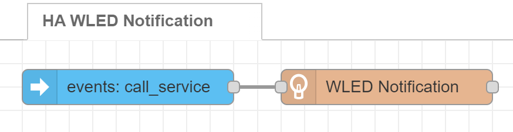

# WLED Notification example flows

## Home Assistant notifications

Triggers the WLED notification every time a notification is sent by Home Assistant, as seen in the [demo video](https://youtu.be/AdlwtjTB3xg).

- [Flow JSON](../examples/Home%20Assistant%20notifications.json)
