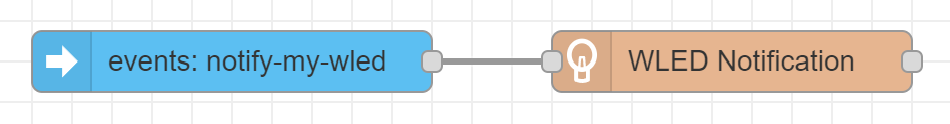

# WLED Notification example flows

## Home Assistant: Notify on service calls

Triggers the WLED notification by a service call in Home Assistant.

<div align="center">
	
</div>

This example specifically listens to calls of HA's notification service (e.g., `notify.my_phone`) to trigger a WLED notification, but it can be easily customized to trigger on other service calls by adjusting the filter in the `events` node. Watch the [video demonstration](https://youtu.be/AdlwtjTB3xg) of WLED displaying a notification effect when Home Assistant sends a notification to a phone.

- [Example flow (JSON)](../examples/Home%20Assistant%20service%20notifications.json)

## Home Assistant: Notify on custom event

Triggers the WLED notification when a custom event is sent by Home Assistant.

<div align="center">
	
</div>

Custom events can be easily sent from Home Assistant in automations and scripts with the `event: <eventname>` action. Advanced users can also individually override the node config for each event.

- Home Assistant example automation:
    ```yaml
    alias: WLED Notification on sunset
    description: "Trigger Node-RED flow on sunset to trigger WLED notification light in yellow color"
    trigger:
      - platform: sun
        event: sunset
        offset: 0
    condition: []
    action:
      # Send custom event which triggers Node_RED flow
      - event: notify-my-wled
        event_data:
          # Optional: Overwrite config of WLED Notification node. This needs 
          # to also be handled in the output properties of the HA "events" node
          # within the flow (see example flow).
          effectColor: "#ff7700" # set effect color to yellow
    mode: single
    ```
- [Example flow (JSON)](../examples/Home%20Assistant%20event%20notifications.json)
